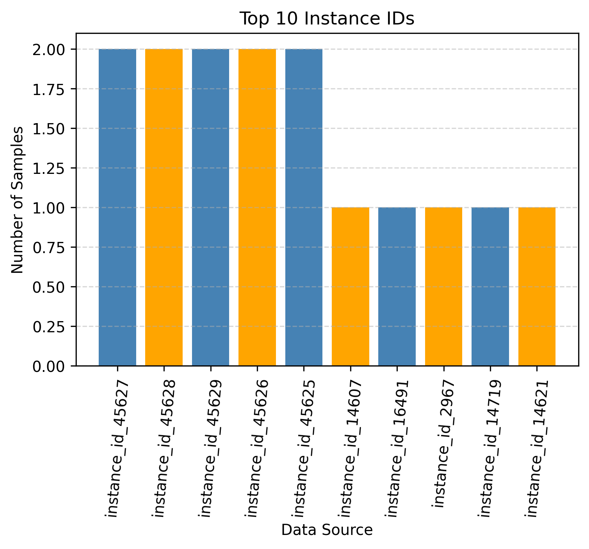

# Cypher Query Generation LLM

## **Project Description** :

**Name : Fadhil Elrizanda**

**NIM : 23524006**

**Institute Technology Bandung**

## Table of Contents

- [Project Overview](#project-overview)
- [Dataset Overview](#dataset-overview-text2cypher-2025v1)
  - [Dataset Structure](#dataset-structure)
  - [Dataset Sample](#dataset-sample)
  - [Dataset Distribution](#dataset-distribution)
- [Model Evaluation](#model-evaluation)
- [Project Structure](#project-structure)
- [Project Progress](#project-progress)

## Project-Overview

This project is to build the LLM from vanila transformer and transformer variant for cypher query generation. The transformer architecture conducted of decoder and decoder. The cypher query generation is used for creating query in field of graph database or knowledge graph. This approach use neo4j graph. This project also use wandb to monitore the version and performance of each transformer architecture. Dataset used is text2cypher-2025v1 which officially published by the neo4j.

## Dataset-Overview-text2cypher-2025v1

This dataset is published by neo4j. The dataset can be accessed [here](https://huggingface.co/datasets/neo4j/text2cypher-2025v1) .The dataset is gathered from the source of neo4j community and for more information can be read here [text2cypher-article](https://aclanthology.org/2025.genaik-1.11.pdf). The dataset consist of total approx 40k row which splitted into train (35.9k) and test (4.44k).

### Dataset-Structure

| Field                        | Description                                                                         |
| ---------------------------- | ----------------------------------------------------------------------------------- |
| **question**                 | Users’ textual question. E.g., “What is the total number of companies?”             |
| **schema**                   | The database schema.                                                                |
| **cypher**                   | Output cypher query. E.g., “MATCH (c:Company) RETURN COUNT(c)”                      |
| **data_source**              | Alias of the dataset source. E.g., "neo4jLabs_synthetic_gpt4turbo"                  |
| **database_reference_alias** | Alias of the database (if available). E.g., None, "neo4jlabs_demo_db_stackoverflow" |
| **instance_id**              | Incremental index assigned per row.                                                 |

### Dataset-Sample

| **Field**                    | **Value**                                                                                                                                                                                                       |
| ---------------------------- | --------------------------------------------------------------------------------------------------------------------------------------------------------------------------------------------------------------- |
| **question**                 | Which 3 countries have the most entities linked as beneficiaries in filings?                                                                                                                                    |
| **schema**                   | The relationships: `(:Filing)-[:BENEFITS]->(:Entity)` `(:Filing)-[:CONCERNS]->(:Entity)` `(:Filing)-[:ORIGINATOR]->(:Entity)` `(:Entity)-[:FILED]->(:Filing)` `(:Entity)-[:COUNTRY]->(:Country)` |
| **cypher**                   | `cypher MATCH (f:Filing)-[:BENEFITS]->(e:Entity)-[:COUNTRY]->(c:Country) WITH c.name AS country, COUNT(e) AS entityCount ORDER BY entityCount DESC LIMIT 3 RETURN country, entityCount `      |
| **data_source**              | `neo4jLabs_synthetic_gpt4o`                                                                                                                                                                                     |
| **instance_id**              | `instance_id_41185`                                                                                                                                                                                             |
| **database_reference_alias** | `neo4jlabs_demo_db_fincen`                                                                                                                                                                                      |

### Dataset-Distribution

The Dataset distribution can be seen in charts below. This information generated by `data_exploration.ipynb`

## Model-Evaluation

Based on the provided [article](https://aclanthology.org/2025.genaik-1.11.pdf), the paper evaluates model performance using Google-BLEU and Exact Match Score. These metrics are commonly used in text-to-code and semantic parsing tasks like natural language to Cypher generation.

| **Evaluation Method** | **Description**                                                                                                                                                                 |
| --------------------- | ------------------------------------------------------------------------------------------------------------------------------------------------------------------------------- |
| **Google-BLEU**       | A variant of BLEU designed for higher correlation with human judgments in translation and generation tasks. It compares n-grams between predicted and reference Cypher queries. |

## Project-Structure

`data_exploration.ipynb` used to data exploration
`train-vanilla-transformer.ipynb` used to train vanila transformer for cypher generation

## Vanila Transformer Configuration

| Model                 | num_layers | num_heads | ff_dim |
| --------------------- | ---------- | --------- | ------ |
| vanila-transformer-v1 | 2          | 4         | 256    |
| vanila-transformer-v2 | 4          | 4         | 512    |
| vanila-transformer-v3 | 8          | 8         | 512    |

## Progress Result

The result of the vanilla-transformer-v1

## Project-Progress

- [x] Download Dataset to local
- [x] Dataset Exploration
- [x] Training Using the pretrained model (Only for testing)
- [x] Building Vanila Transformer Architecture
- [x] Hyperparameter Tuning (at least 3 variation) Vanila Transformer Architecture
- [ ] Building Transformer Variant Architecture
- [ ] Evaluation Transformer Variant
- [ ] Project Summary
